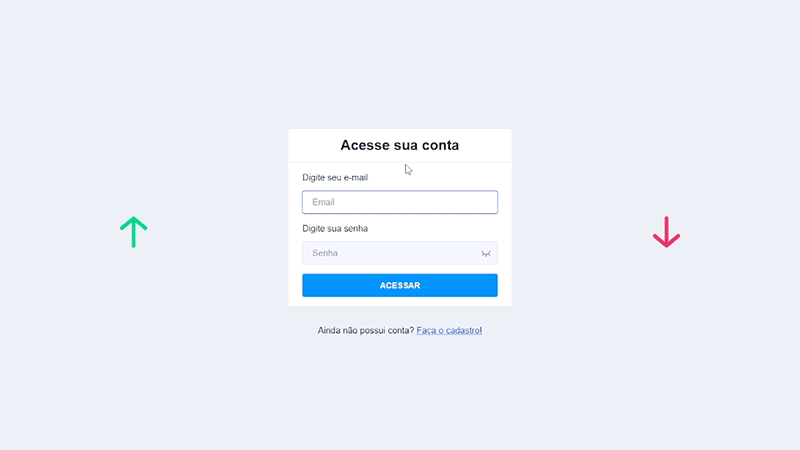

# ➡[SPA com Angular 2+ e Nebular](https://front-finan.herokuapp.com/)⬅

Teaser: 



## 🔖Sobre

- CRUD coleções
- Dashboard
- Lazy loading

## 💻Teconologias Utilizadas
- Angular 2+
- Typescript/Javascript
- NodeJS/Express
- SAAS
- Nebular
- Bootstrap
- Ngx-Charts

---

## 💾Instalação

**Instalar Angular CLI:**

```shell
$ npm install -g @angular/cli
```

**Instalar dependencias:**

```shell
$ npm install
```
**Execução:** 

```
ng serve -o
```
**📌OBSERVAÇÕES**

Variável de ambiente **PORTA_URL** encontrada em **src/environments** Já se encontra preenchida com acesso a API.

---

**LINKS EXTERNOS**

API:
- [Repositório](https://github.com/markyscorrea/back-finan)
- [Documentação em nuvem](https://back-finan.herokuapp.com/api-docs/)

SPA:
- [Resultado em nuvem](https://front-finan.herokuapp.com/login)


**Ambos os projetos tiveram seus resultados publicados no servidor de hospedagem gratuito HEROKU.**

---

Desenvolvido por Márkys Corrêa.